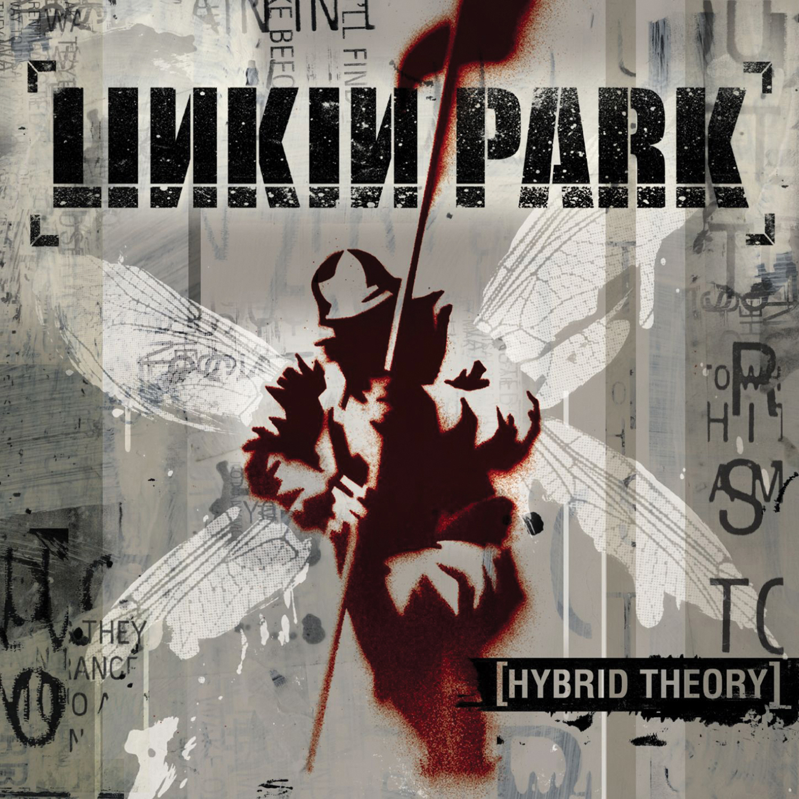
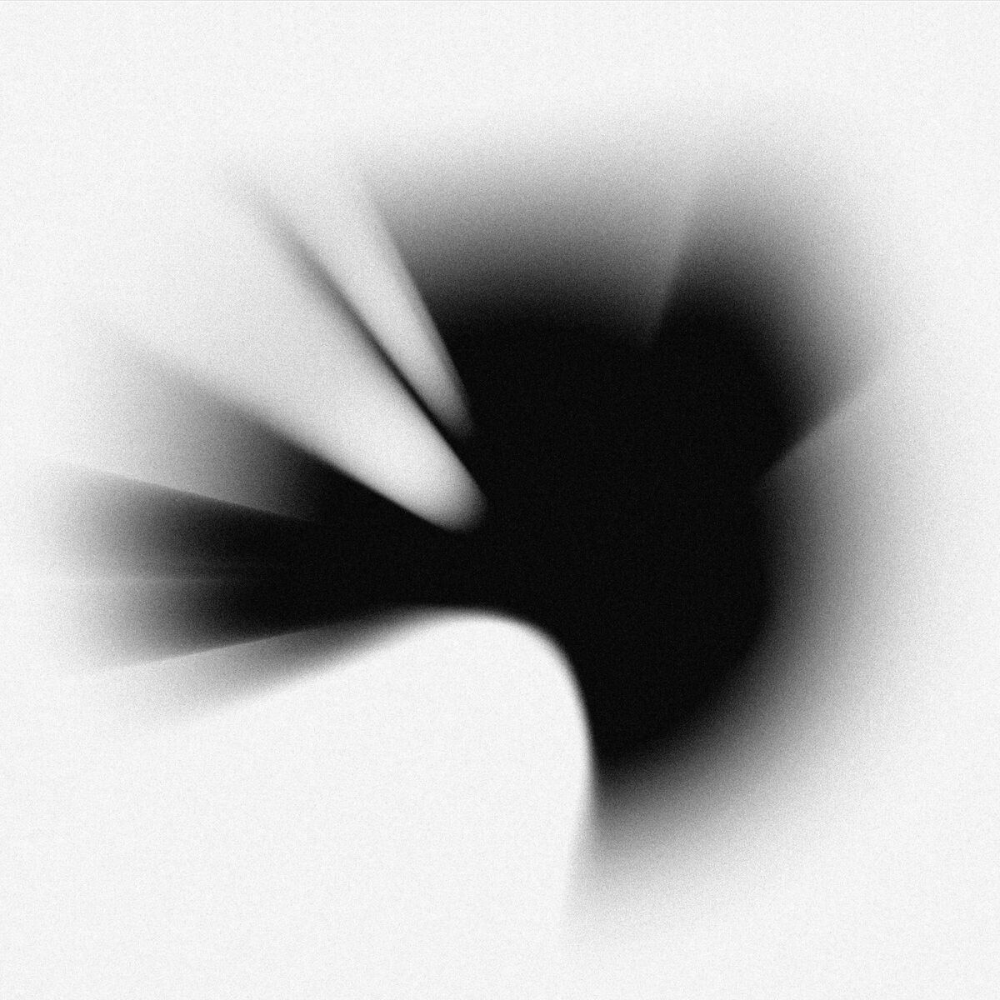
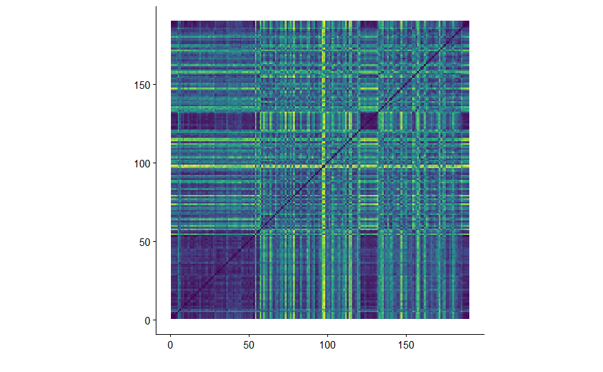

```{r setup, include=FALSE}
knitr::opts_chunk$set(echo = TRUE)
```

```{r imports,echo=FALSE}
library(remotes)
library(plotly)
library(tidyverse)
library(compmus)
library(flexdashboard)
library(tidymodels)
library(ggdendro)
library(heatmaply)
library(ggplot2)
library(ggradar)
```

```{css, echo=FALSE}
.card img {
  width: 100%;
  height: 100%;
  object-fit: contain;
  display: block;
}
```
# Corpus

## Column {width=100%}

### Row {height=100%}

::: {.card width=50%}
Linkin Park (Previously known as Hybrid Theory) is a rock/Nu-metal band that gained popularity in the early 2000s with their unique hybrid of rap and metal. The band stopped performing in 2017 after the lead-singer Chester Bennington commited suicide.
In 2024 the band made a comeback with a new, female lead-singer: Emily Armstrong.
The band decided to start over with a woman as lead singer to give the band a new sound, without trying to replace the famous, and to many irreplacable, Chester Bennington. They started over: *From Zero*.
The goal of this portfolio is to analyse the difference in sound since the lead-singer change.
Because Chester Bennington has a much bigger repetoire, I will primarily be comparing *Meteora* with *From Zero*. But I will also compare the older albums with eachother to find out what the diversity and characteristics of the *Linkin Park Sound* entail.


:::

::: {.card width=50%}

:::

# LP 2000-2017: Chesters Repetoire
```{r Prefiltering, echo=FALSE}
# Load data
chester <- read_csv("./dat/Chester.csv")

# Select only audio features used for clustering
features <- c("Danceability", "Energy", "Loudness", "Speechiness",
              "Acousticness", "Instrumentalness", "Liveness", "Valence", "Tempo")

# Remove rows with missing feature values (e.g. "Foreword" interlude)
chester_clean <- chester |>
  filter(!is.na(Danceability)) |>
  select(`Track Name`, `Album Name`, all_of(features))

# ── Helper: filter, drop constant columns, and scale ─────────────────────────

safe_juice <- function(data, album_name) {
  data |>
    filter(`Album Name` == album_name) |>
    column_to_rownames("Track Name") |>
    select(all_of(features)) |>
    as.matrix() |>
    (\(m) m[, apply(m, 2, sd, na.rm = TRUE) > 0])() |>  # drop constant columns
    scale()
}

# ── Filter per album and create named matrices (juice) ────────────────────────

hybrid_theory_juice       <- safe_juice(chester_clean, "Hybrid Theory (Bonus Edition)")
meteora_juice             <- safe_juice(chester_clean, "Meteora")
minutes_to_midnight_juice <- safe_juice(chester_clean, "Minutes to Midnight")
a_thousand_suns_juice     <- safe_juice(chester_clean, "A Thousand Suns")
living_things_juice       <- safe_juice(chester_clean, "LIVING THINGS")
hunting_party_juice       <- safe_juice(chester_clean, "The Hunting Party")
one_more_light_juice      <- safe_juice(chester_clean, "One More Light")

```

## Column {width=100%, height=10%}

::: {.card heigth=5%}
To get a better Idea of what we are comparing, lets have a look at the the Linkin Park Albums from 2000-2017, with Chester Bennington as Lead-Singer. On this page are the dendrograms and heatmaps of all the albums to see diversity within the albums. At the bottom of this page are a dendrogram, heatmap and spiderchart, illustrating the similarities and differences between albums. 
Disclaimer: Be aware that these graphs are acquired using Spotify API, which is not a watertight indexing system. Results are an estimation and could very well be wrong. 
:::


### Row
::: {.card title="Hybrid Theory: (2000)"}


:::

::: {.card title="Meteora: (2003)"}


:::

::: {.card title="Minutes to Midnight: (2007)"}


:::
::: {.card title="A Thousand Suns: (2010)"}




:::

### Row
```{r Hybrid Theory, echo=FALSE}
# Hybrid Theory
dist(hybrid_theory_juice, method = "euclidean") |>
  hclust(method = "average") |>
  dendro_data() |>
  ggdendrogram() +
  labs(title = "Hybrid Theory (Bonus Edition)")
```

```{r Meteora, echo=FALSE}
# Meteora
dist(meteora_juice, method = "euclidean") |>
  hclust(method = "average") |>
  dendro_data() |>
  ggdendrogram() +
  labs(title = "Meteora")
```

```{r Minutes to Midnight, echo=FALSE}
# Minutes to Midnight
dist(minutes_to_midnight_juice, method = "euclidean") |>
  hclust(method = "average") |>
  dendro_data() |>
  ggdendrogram() +
  labs(title = "Minutes to Midnight")

```

```{r A Thousand Suns, echo=FALSE}
# A Thousand Suns
dist(a_thousand_suns_juice, method = "euclidean") |>
  hclust(method = "average") |>
  dendro_data() |>
  ggdendrogram() +
  labs(title = "A Thousand Suns")
```

### Row
```{r, echo=FALSE}
heatmaply(hybrid_theory_juice,  hclustfun = hclust, hclust_method = "average", dist_method = "euclidean", main = "Hybrid Theory (Bonus Edition)")
```

```{r, echo=FALSE}
heatmaply(meteora_juice,        hclustfun = hclust, hclust_method = "average", dist_method = "euclidean", main = "Meteora")
```

```{r, echo=FALSE}
heatmaply(minutes_to_midnight_juice, hclustfun = hclust, hclust_method = "average", dist_method = "euclidean", main = "Minutes to Midnight")
```

```{r, echo=FALSE}
heatmaply(a_thousand_suns_juice,     hclustfun = hclust, hclust_method = "average", dist_method = "euclidean", main = "A Thousand Suns")
```

### Row
::: {.card title="Living Things(2016)"}


:::

::: {.card title="The Hunting Party(2014)"}


:::

::: {.card title="One More Light(2017)"}


:::
### Row


```{r, echo=FALSE}
# Living Things
dist(living_things_juice, method = "euclidean") |>
  hclust(method = "average") |>
  dendro_data() |>
  ggdendrogram() +
  labs(title = "LIVING THINGS")
```

```{r, echo=FALSE}
# The Hunting Party
dist(hunting_party_juice, method = "euclidean") |>
  hclust(method = "average") |>
  dendro_data() |>
  ggdendrogram() +
  labs(title = "The Hunting Party")
```

```{r, echo=FALSE}
# One More Light
dist(one_more_light_juice, method = "euclidean") |>
  hclust(method = "average") |>
  dendro_data() |>
  ggdendrogram() +
  labs(title = "One More Light")
```


### Row

```{r, echo=FALSE}
heatmaply(living_things_juice,  hclustfun = hclust, hclust_method = "average", dist_method = "euclidean", main = "LIVING THINGS")
```

```{r, echo=FALSE}
heatmaply(hunting_party_juice,  hclustfun = hclust, hclust_method = "average", dist_method = "euclidean", main = "The Hunting Party")
```

```{r, echo=FALSE}
heatmaply(one_more_light_juice, hclustfun = hclust, hclust_method = "average", dist_method = "euclidean", main = "One More Light")
```

### Row

::: {.card title= "Album Pairing"}
In the plot below we can see the clustering of the albums. Intuitively they seem to be quite correct. *Minutes to Midnight* and *One more light* are relatively low energy mellow albums with a softer sound. *Hybrid Theory* *LIVING THINGS* and *Meteora* are their loudest most high energy albums, often upbeat with a dominant distorted guitar and intense screaming vocals in the chorus.  *A thousand suns* and *The Hunting Party* are the albums I would call furthest away from "the Linkin Park sound"; They are experimental, contain more clean piano and general acoustics and contain more soft vocals. 
```{r, echo=FALSE}

# ── Album-level comparison ────────────────────────────────────────────────────

# Build a summary matrix: one row per album, columns = mean of each feature
album_means <- chester_clean |>
  group_by(`Album Name`) |>
  summarise(across(all_of(features), \(x) mean(x, na.rm = TRUE))) |>
  column_to_rownames("Album Name") |>
  as.matrix() |>
  scale()  # scale so features are comparable across albums

# 1. Dendrogram of albums
dist(album_means, method = "euclidean") |>
  hclust(method = "average") |>
  dendro_data() |>
  ggdendrogram() +
  labs(title = "Album similarity (mean features, euclidean distance)")


```

:::

::: {.card title="Difference Quantisised"}
This heatmap shows the deviance of *A Thousand Suns* in terms of acousticness, it contains outliers on all fronts. The hunting party also shows a big standard deviation in almost every way. One can imagine them being paired together.
We can see that *LIVING THINGS*, *Meteora* and *Hybrid Theory* indeed show a higher Energy and Loudness compared to other albums. That being said, *The Hunting Party* shows the same pattern but has a very different sound, explained by previous features.
```{r, echo=FALSE}


# 2. Heatmap of albums
heatmaply(
  album_means,
  hclustfun = hclust,
  hclust_method = "average",
  dist_method = "euclidean",
  main = "Album comparison (mean feature profiles)"
)
```

:::


::: {.card title="Every album visualised in extremes"}
```{r, echo=FALSE}

# 3. Radar / spider chart of mean feature profiles
library(ggradar)  # install.packages("ggradar") if needed

chester_clean |>
  group_by(`Album Name`) |>
  summarise(across(all_of(features), \(x) mean(x, na.rm = TRUE))) |>
  mutate(across(all_of(features), \(x) (x - min(x)) / (max(x) - min(x)))) |>
  rename(group = `Album Name`) |>
  ggradar(
    font.radar = "sans",
    grid.label.size = 4,
    axis.label.size = 3,
    group.line.width = 1,
    group.point.size = 2
  ) +
  labs(title = "Album mean feature profiles") +
  theme(
    legend.position = "right",
    legend.text = element_text(size = 7),
    legend.key.size = unit(0.4, "cm")
  )

```

:::


# Emily's repetoire: From Zero

## Row {height=40%}

### Column {width=100%}


::: {.card}
Since Emily Armstrong joined Linkin Park in 2024, they made one album, *From Zero*.
Below are the dendrogram, heatmap, and a scatterplot of the songs showing how they cluster by audio features filtered plotted on tempo, energy, loudness and speechiness.
:::

```{r from_zero_data, echo=FALSE}
emily <- read_csv("./dat/Emily.csv")

features <- c("Danceability", "Energy", "Loudness", "Speechiness",
              "Acousticness", "Instrumentalness", "Liveness", "Valence", "Tempo")

from_zero_juice <- emily |>
  filter(!is.na(Danceability)) |>
  filter(`Album Name` == "From Zero (Deluxe Edition)") |>
  filter(`Track Name` != "From Zero (Intro)") |>
  select(`Track Name`, all_of(features)) |>
  column_to_rownames("Track Name") |>
  as.matrix() |>
  (\(m) m[, apply(m, 2, sd, na.rm = TRUE) > 0])() |>
  scale()
```

## Row {height=60%}


::: {.card}
**From Zero Dendrogram**
As we will see more often in this portfolio, *Overflow* seems to be an outlier in this album, not strange that it is far from *Two-Faced* as *Overflow* is a quite soft, acoustic song with long sustain while *Two-Faced* is very fast paced- short attack, loud, distorted and intense.
```{r from_zero_dendrogram, echo=FALSE}
dist(from_zero_juice, method = "euclidean") |>
  hclust(method = "average") |>
  dendro_data() |>
  ggdendrogram() +
  labs(title = "From Zero — song similarity (euclidean, average linkage)")
```
:::

::: {.card}
**From Zero Heatmap**
Looking at this heatmap, the outlier of *Casualty* surprises me quite a bit. The song is quite instrumental indeed, but also scores higher than average on speechiness. My hypothesis is that this could be because the song has a very dominant simple guitar riff and is very drum heavy.
```{r from_zero_heatmap, echo=FALSE}
p <- heatmaply(
  from_zero_juice,
  hclustfun = hclust,
  hclust_method = "average",
  dist_method = "euclidean"
)
plotly::as_widget(p)
```
:::

::: {.card}
**From Zero: Tempo vs Energy**
We can clearly see the inconsistencies of the spotify API in this graph. While most tempi are accurately plotted, *Cut the Bridge* is measured in half-tempo instead of the actual song BPM. Knowing the song, I think the loudness is also lower than to be expected.
If we assume that the other measurements are correct, this album seems to be quite diverse. Most songs have a high energy, but speechiness and tempo differ quite a bit.
```{r from_zero_scatter, echo=FALSE}
emily |>
  filter(!is.na(Danceability)) |>
  filter(`Album Name` == "From Zero (Deluxe Edition)") |>
  filter(`Track Name` != "From Zero (Intro)") |>
  ggplot(aes(
    x = Tempo,
    y = Energy,
    label = `Track Name`,
    size = -Loudness,
    colour = Speechiness
  )) +
  geom_point(alpha = 0.8) +
  geom_text(
    size = 3,
    vjust = -1,
    hjust = 0.5,
    check_overlap = TRUE
  ) +
  scale_colour_viridis_c(option = "plasma", name = "Speechiness") +
  scale_size_continuous(name = "Loudness (louder = bigger)", range = c(3, 10)) +
  labs(
    title = "From Zero — Tempo vs Energy",
    subtitle = "Size = loudness (larger = louder), colour = speechiness",
    x = "Tempo (BPM)",
    y = "Energy"
  ) +
  theme_minimal()
```
:::


# Chester vs Emily

## Column {width=100%}

### Row

::: {.card}

When comparing the two artists, what do we look at? Chester has been with the band for 17 years, Emily 2. Let's put that into perspective. Here we compare all the Linkin park song based on the most important audio features from the spotify API.
```{r comparing artists, echo=FALSE}

# Combine Chester and Emily data, label by singer
chester_scatter <- chester |>
  filter(!is.na(Danceability), !is.na(Tempo)) |>
  select(`Track Name`, `Album Name`, Energy, Tempo, Loudness, Speechiness) |>
  mutate(Singer = "Chester")

emily_scatter <- emily |>
  filter(!is.na(Danceability), !is.na(Tempo)) |>
  filter(`Track Name` != "From Zero (Intro)") |>
  select(`Track Name`, `Album Name`, Energy, Tempo, Loudness, Speechiness) |>
  mutate(Singer = "Emily")

bind_rows(chester_scatter, emily_scatter) |>
  ggplot(aes(
    x = Tempo,
    y = Energy,
    size = -Loudness,      # louder = bigger dot
    colour = Speechiness,
    shape = Singer
  )) +
  geom_point(alpha = 0.7) +
  scale_colour_viridis_c(option = "plasma", name = "Speechiness") +
  scale_size_continuous(name = "Loudness (louder = bigger)", range = c(2, 8)) +
  scale_shape_manual(values = c("Chester" = 16, "Emily" = 17)) +
  labs(
    title = "Chester vs Emily — Tempo vs Energy",
    subtitle = "Shape = singer, size = loudness (larger = louder), colour = speechiness",
    x = "Tempo (BPM)",
    y = "Energy"
  ) +
  theme_minimal()
```
As we can see, this corpus is far too big for a detailed comparison.
We can see that most songs are high energy, as is to be expected. Emily has little to no low energy songs in her repetoire (yet).

:::

::: {.card}
When we take a look at the heatmap of the average features of each album, we see that *Meteora* scores relatively "average" on each feature, scoring a bit higher on energy and loudness. Because this is their most popular album, it scores most average in feature comparison and it sounds most similar to *From Zero* (In my opinion), I will be comparing *Meteora* with *From Zero*, in more detail
```{r, echo=FALSE}


# 2. Heatmap of albums
heatmaply(
  album_means,
  hclustfun = hclust,
  hclust_method = "average",
  dist_method = "euclidean",
  main = "Album comparison (mean feature profiles)"
)
```

:::


### Row {height=100%}
::: {.card}


:::

::: {.card}


:::


### Row

::: {.card}
#### Chester Bennington era — *Meteora* (2003)


Chester's era defined Linkin Park's signature sound: distorted guitars, rap-rock fusion, and deeply personal lyrics.
:::

::: {.card}
#### Emily Armstrong era — *From Zero* (2024)


Emily's debut with the band brings a fresh vocal style, with the band exploring new sonic territory.
:::

### Row

::: {.card title= "Album Feature Comparison API"}
```{r, echo=FALSE}
# 3. Radar / spider chart of mean feature profiles
library(ggradar)  # install.packages("ggradar") if needed
Meteora <- read_csv("./dat/Meteora.csv")
clean_comparison <- bind_rows(emily, Meteora)

clean_comparison |>
  group_by(`Album Name`) |>
  summarise(across(all_of(features), \(x) mean(x, na.rm = TRUE))) |>
  mutate(across(all_of(features), \(x) (x - min(x)) / (max(x) - min(x)))) |>
  rename(group = `Album Name`) |>
  ggradar(
    font.radar = "sans",
    grid.label.size = 4,
    axis.label.size = 3,
    group.line.width = 1,
    group.point.size = 2
  ) +
  labs(title = "Album mean feature profiles") +
  theme(
    legend.position = "right",
    legend.text = element_text(size = 7),
    legend.key.size = unit(0.4, "cm")
  )

```
Okay, this is not what I expected, at all. I understand the liveness and tempo, but the difference is probably very small.
Furthermore, when looking back at my *From Zero heatmap* from *Emily's repetoire*, we can see that the song *Overflow* scores extremely high on acousticness compared to the rest. I suspect that this one song heavily skews this graph aswell.
I guess that this plot is nuanced when comparing various albums, but very extreme when comparing two.
:::
 
# Pitch/ Chromagrams

```{r chords code, echo=FALSE}
circshift <- function(v, n) {
  if (n == 0) v else c(tail(v, n), head(v, -n))
}

#      C     C#    D     Eb    E     F     F#    G     Ab    A     Bb    B
major_chord <-
  c(   1,    0,    0,    0,    1,    0,    0,    1,    0,    0,    0,    0)
minor_chord <-
  c(   1,    0,    0,    1,    0,    0,    0,    1,    0,    0,    0,    0)
seventh_chord <-
  c(   1,    0,    0,    0,    1,    0,    0,    1,    0,    0,    1,    0)

major_key <-
  c(6.35, 2.23, 3.48, 2.33, 4.38, 4.09, 2.52, 5.19, 2.39, 3.66, 2.29, 2.88)
minor_key <-
  c(6.33, 2.68, 3.52, 5.38, 2.60, 3.53, 2.54, 4.75, 3.98, 2.69, 3.34, 3.17)

chord_templates <-
  tribble(
    ~name, ~template,
    "Gb:7", circshift(seventh_chord, 6),
    "Gb:maj", circshift(major_chord, 6),
    "Bb:min", circshift(minor_chord, 10),
    "Db:maj", circshift(major_chord, 1),
    "F:min", circshift(minor_chord, 5),
    "Ab:7", circshift(seventh_chord, 8),
    "Ab:maj", circshift(major_chord, 8),
    "C:min", circshift(minor_chord, 0),
    "Eb:7", circshift(seventh_chord, 3),
    "Eb:maj", circshift(major_chord, 3),
    "G:min", circshift(minor_chord, 7),
    "Bb:7", circshift(seventh_chord, 10),
    "Bb:maj", circshift(major_chord, 10),
    "D:min", circshift(minor_chord, 2),
    "F:7", circshift(seventh_chord, 5),
    "F:maj", circshift(major_chord, 5),
    "A:min", circshift(minor_chord, 9),
    "C:7", circshift(seventh_chord, 0),
    "C:maj", circshift(major_chord, 0),
    "E:min", circshift(minor_chord, 4),
    "G:7", circshift(seventh_chord, 7),
    "G:maj", circshift(major_chord, 7),
    "B:min", circshift(minor_chord, 11),
    "D:7", circshift(seventh_chord, 2),
    "D:maj", circshift(major_chord, 2),
    "F#:min", circshift(minor_chord, 6),
    "A:7", circshift(seventh_chord, 9),
    "A:maj", circshift(major_chord, 9),
    "C#:min", circshift(minor_chord, 1),
    "E:7", circshift(seventh_chord, 4),
    "E:maj", circshift(major_chord, 4),
    "G#:min", circshift(minor_chord, 8),
    "B:7", circshift(seventh_chord, 11),
    "B:maj", circshift(major_chord, 11),
    "D#:min", circshift(minor_chord, 3)
  )

key_templates <-
  tribble(
    ~name, ~template,
    "Gb:maj", circshift(major_key, 6),
    "Bb:min", circshift(minor_key, 10),
    "Db:maj", circshift(major_key, 1),
    "F:min", circshift(minor_key, 5),
    "Ab:maj", circshift(major_key, 8),
    "C:min", circshift(minor_key, 0),
    "Eb:maj", circshift(major_key, 3),
    "G:min", circshift(minor_key, 7),
    "Bb:maj", circshift(major_key, 10),
    "D:min", circshift(minor_key, 2),
    "F:maj", circshift(major_key, 5),
    "A:min", circshift(minor_key, 9),
    "C:maj", circshift(major_key, 0),
    "E:min", circshift(minor_key, 4),
    "G:maj", circshift(major_key, 7),
    "B:min", circshift(minor_key, 11),
    "D:maj", circshift(major_key, 2),
    "F#:min", circshift(minor_key, 6),
    "A:maj", circshift(major_key, 9),
    "C#:min", circshift(minor_key, 1),
    "E:maj", circshift(major_key, 4),
    "G#:min", circshift(minor_key, 8),
    "B:maj", circshift(major_key, 11),
    "D#:min", circshift(minor_key, 3)
  )
```

## Column {width=100%}

### Row

::: {.card title= "Numb Keygram"}

Here we can see a keygram and a Chordgram of the song *Numb* by *Linking Park*, using Temperley’s proposed improvements. The dominant chords seem to be F#:min, D:maj, Gb:maj and Gb:7, Where I expected F#min, D:maj, A:maj and E:maj.
```{r Chromagram Numb, echo=FALSE}
NumbChroma <- read_csv("./dat/NumbChroma.csv")
NumbChroma |> 
  compmus_wrangle_chroma() |> 
  filter(row_number() %% 50L == 0L) |> 
  compmus_match_pitch_template(
    key_templates,         # Change to chord_templates if desired
    method = "euclidean",  # Try different distance metrics
    norm = "manhattan"     # Try different norms
  ) |>
  ggplot(
    aes(x = start + duration / 2, width = 50 * duration, y = name, fill = d)
  ) +
  geom_tile() +
  scale_fill_viridis_c(guide = "none") +
  theme_minimal() +
  labs(x = "Time (s)", y = "")
```

:::


::: {.card title= "Faint Keygram"}
All The Keygrams seem relatively useless as there are a lot of keys being used. If anything, you only see intensity in the song.
```{r Chromagram Faint, echo=FALSE}
FaintChroma <- read_csv("./dat/FaintChroma.csv")
FaintChroma |> 
  compmus_wrangle_chroma() |> 
  filter(row_number() %% 50L == 0L) |> 
  compmus_match_pitch_template(
    key_templates,         # Change to chord_templates if desired
    method = "euclidean",  # Try different distance metrics
    norm = "manhattan"     # Try different norms
  ) |>
  ggplot(
    aes(x = start + duration / 2, width = 50 * duration, y = name, fill = d)
  ) +
  geom_tile() +
  scale_fill_viridis_c(guide = "none") +
  theme_minimal() +
  labs(x = "Time (s)", y = "")
```

:::


::: {.card title= "Somewhere I Belong Keygram"}

```{r Chromagram Somewhere I belong, echo=FALSE}
SIBChroma <- read_csv("./dat/SIBChroma.csv")
SIBChroma |> 
  compmus_wrangle_chroma() |> 
  filter(row_number() %% 50L == 0L) |> 
  compmus_match_pitch_template(
    key_templates,         # Change to chord_templates if desired
    method = "euclidean",  # Try different distance metrics
    norm = "manhattan"     # Try different norms
  ) |>
  ggplot(
    aes(x = start + duration / 2, width = 50 * duration, y = name, fill = d)
  ) +
  geom_tile() +
  scale_fill_viridis_c(guide = "none") +
  theme_minimal() +
  labs(x = "Time (s)", y = "")
```

:::


### Row

::: {.card title= "Numb Chordgram"}

```{r Chromagram Numb2, echo=FALSE}
NumbChroma |> 
  compmus_wrangle_chroma() |> 
  filter(row_number() %% 50L == 0L) |> 
  compmus_match_pitch_template(
    chord_templates,         # Change to chord_templates if desired
    method = "euclidean",  # Try different distance metrics
    norm = "manhattan"     # Try different norms
  ) |>
  ggplot(
    aes(x = start + duration / 2, width = 50 * duration, y = name, fill = d)
  ) +
  geom_tile() +
  scale_fill_viridis_c(guide = "none") +
  theme_minimal() +
  labs(x = "Time (s)", y = "")
```
:::

::: {.card title= "Faint Chordgram"}
Except for highlighting minor chords, the chordgrams seem to all be equally uninteresting. If anything, they highlight noise.
```{r Chromagram Faint2, echo=FALSE}
FaintChroma |> 
  compmus_wrangle_chroma() |> 
  filter(row_number() %% 50L == 0L) |> 
  compmus_match_pitch_template(
    chord_templates,         # Change to chord_templates if desired
    method = "euclidean",  # Try different distance metrics
    norm = "manhattan"     # Try different norms
  ) |>
  ggplot(
    aes(x = start + duration / 2, width = 50 * duration, y = name, fill = d)
  ) +
  geom_tile() +
  scale_fill_viridis_c(guide = "none") +
  theme_minimal() +
  labs(x = "Time (s)", y = "")
```

:::

::: {.card title= "Somewhere I Belong Chordgram"}

```{r Chromagram Somewhere I belong2, echo=FALSE}
SIBChroma |> 
  compmus_wrangle_chroma() |> 
  filter(row_number() %% 50L == 0L) |> 
  compmus_match_pitch_template(
    chord_templates,         # Change to chord_templates if desired
    method = "euclidean",  # Try different distance metrics
    norm = "manhattan"     # Try different norms
  ) |>
  ggplot(
    aes(x = start + duration / 2, width = 50 * duration, y = name, fill = d)
  ) +
  geom_tile() +
  scale_fill_viridis_c(guide = "none") +
  theme_minimal() +
  labs(x = "Time (s)", y = "")
```

:::


# DTW
## Column {width=100%}

### Row
::: {.card title="DTW The Emptiness Machine"}
Although this is the same song but acapella, clearly the differences are too big to form an informative Dynamic time warping plot.
There seems to be a gap or some missing data, possibly influencing the noisy result. There are some diagonal lines visible but I do not think it is valid to name them as significant.
```{r, echo=FALSE}
ChromaEmpti <- read_csv("./dat/ChromaEmpti.csv")
ChromaEmptiAcapella <- read_csv("./dat/ChromaEmptiAcapella.csv")
compmus_long_distance(
  ChromaEmpti |> 
    compmus_wrangle_chroma() |> 
    mutate(pitches = map(pitches, compmus_normalise, "chebyshev")) |> 
    filter(row_number() %% 50L == 0L),
  ChromaEmptiAcapella |> 
    compmus_wrangle_chroma() |> 
    mutate(pitches = map(pitches, compmus_normalise, "chebyshev")) |> 
    filter(row_number() %% 50L == 0L),
  feature = pitches,
  method = "euclidean"
) |>
  filter(!is.nan(d)) |> 
  ggplot(
    aes(
      x = xstart + xduration / 2,
      width = 50 * xduration,
      y = ystart + yduration / 2,
      height = 50 * yduration,
      fill = d
    )
  ) +
  geom_tile() +
  coord_equal() +
  labs(x = "Original", y = "Acapella") +
  theme_minimal() +
  scale_fill_viridis_c(guide = NULL)
```
:::


# Timbre and SSM

## Column {width=100%}

### Row
::: {.card title= "The Emptiness Machine Cepstogram"}

```{r Cepstrogram, echo=FALSE}
The_Emptiness_Machine_Timbre <- read_csv("./dat/The_Emptiness_Machine_Timbre.csv")

The_Emptiness_Machine_Timbre|>
  compmus_wrangle_timbre() |> 
  mutate(timbre = map(timbre, compmus_normalise, "manhattan")) |>
  compmus_gather_timbre() |>
  ggplot(
    aes(
      x = start + duration / 2,
      width = duration,
      y = mfcc,
      fill = value
    )
  ) +
  geom_tile() +
  labs(x = "Time (s)", y = NULL, fill = "Magnitude") +
  scale_fill_viridis_c() +                              
  theme_classic()
```
Clearly visible from this cepstrogram is that the song starts soft, with Mike Shinoda rapping, a synthesizer and some soft drums in the background. There are 2 distinct blocks in the plot when Emily Armstrong starts singing and the guitars and drums kick in loudly. The change happens at around 55 seconds, and at around 135 seconds with a short pause in between where Shinoda builds up the tension again.
:::

::: {.card title= "The Emptiness Machine Self Similarity Matrix"}


```{r SSM, eval=FALSE, echo=FALSE}
The_Emptiness_Machine_Timbre |>
compmus_wrangle_timbre() |> 
  filter(row_number() %% 50L == 0L) |> 
  mutate(timbre = map(timbre, compmus_normalise, "euclidean")) |>
  compmus_self_similarity(timbre, "cosine") |> 
  ggplot(
    aes(
      x = xstart + xduration / 2,
      width = 50 * xduration,
      y = ystart + yduration / 2,
      height = 50 * yduration,
      fill = d
    )
  ) +
  geom_tile() +
  coord_fixed() +
  scale_fill_viridis_c(guide = "none") +
  theme_classic() +
  labs(x = "", y = "")
```

This Self similarity matrix shows a clear structure with 3 major sections. The track does not clearly repeat itself each time but changes. My hypothesis is that this indicates the added intensity each repetition that is characteristic of Linkin Park songs. The intensity develops troughout the song as I discussed in the cepstrogram.
I chose to plot only one SSM because of a lack of computing power (Rendering one takes 10min and I don't have a potato pc)
:::
# Novelty and Tempograms

## Column {width=20%}

### Row {height=15%}

::: {.card title="Explanation"}
I chose to use the DFT of every track because the ACT often showed the beat in 1/16th, 1/8th, 1/4th and 1/2nd tempo, and double tempo, where DFT almost always shows the accurate or double tempo. I chose 4 tracks, 2 from each album/singer, because they are the most popular songs as well as quite comparable to the ear.
:::

### Row {height=85%}

## Column {width=40%}

::: {.card title="Noveltyplot The Emptiness Machine"}
Looking at the noveltyplot, one would expect this song to start explosive relatively fast. However this plot is misleading. The peak you see is probably the attack of a highhat that is very loud compared to the rest of the intro. The 30second window of this noveltyplot is a bit small for this song has quite a long, soft intro. making the peakes relatively high where absolutely low.
```{r,echo=FALSE}
library(tidyverse)
library(compmus)

```

```{r, echo = FALSE}

The_Emptiness_Machine_Novelty <- read_csv("./dat/The_Emptiness_Machine_Novelty.csv")

The_Emptiness_Machine_Novelty |>
  ggplot(aes(x = TIME, y = VALUE)) +
  geom_line() +
  xlim(0, 30) +                         # Adjust the limits to the desired time range
  theme_minimal() +
  labs(x = "Time (s)", y = "Novelty")
```
***

:::

::: {.card title="ACT The Emptiness Machine"}
We can see that the ACT is very bad at predicting the tempo, where the top bar is correct.

```{r, echo = FALSE}
The_Emptiness_Machine_ACT <- read_csv("./dat/The_Emptiness_Machine_ACT.csv")

The_Emptiness_Machine_ACT |> 
  pivot_longer(-TIME, names_to = "tempo") |> 
  mutate(tempo = as.numeric(tempo)) |> 
  ggplot(aes(x = TIME, y = tempo, fill = value)) +
  geom_raster() +
  scale_y_continuous(transform = c("reciprocal", "reverse"), breaks = seq(50, 350, 100)) +    
  scale_fill_viridis_c(guide = "none") +
  labs(x = "Time (s)", y = "Tempo (BPM)") +
  theme_classic()
```
***
:::

## Column {width=40%}
::: {.card title="DFT The Emptiness Machine"}
Real BPM: 184

The DFT shows a much better result, it gets the real tempo as well as double-time, which isn't uncommon in rock music.
```{r, echo = FALSE}
The_Emptiness_Machine_DFT <- read_csv("./dat/The_Emptiness_Machine_DFT.csv")
The_Emptiness_Machine_DFT |> 
  pivot_longer(-TIME, names_to = "tempo") |> 
  mutate(tempo = as.numeric(tempo)) |> 
  ggplot(aes(x = TIME, y = tempo, fill = value)) +
  geom_raster() +
  scale_fill_viridis_c(guide = "none") +
  labs(x = "Time (s)", y = "Tempo (BPM)") +
  theme_classic()
```
***
:::

::: {.card title="DFT Heavy Is The Crown"}
Real BPM: 128

Here the DFT makes a less accurate prediction, capturing the 128 but also icluding double and triple time.
```{r, echo = FALSE}
Heavy_Is_The_Crown_DFT <- read_csv("./dat/Heavy_Is_The_Crown_DFT.csv")
Heavy_Is_The_Crown_DFT |> 
  pivot_longer(-TIME, names_to = "tempo") |> 
  mutate(tempo = as.numeric(tempo)) |> 
  ggplot(aes(x = TIME, y = tempo, fill = value)) +
  geom_raster() +
  scale_fill_viridis_c(guide = "none") +
  labs(x = "Time (s)", y = "Tempo (BPM)") +
  theme_classic()
```
***
:::

::: {.card title="DFT Faint"}
Real BPM: 135

This is the least accurate prediction for the dominant one is double time.
```{r, echo = FALSE}
Faint_DFT <- read_csv("./dat/Faint_DFT.csv")
Faint_DFT |> 
  pivot_longer(-TIME, names_to = "tempo") |> 
  mutate(tempo = as.numeric(tempo)) |> 
  ggplot(aes(x = TIME, y = tempo, fill = value)) +
  geom_raster() +
  scale_fill_viridis_c(guide = "none") +
  labs(x = "Time (s)", y = "Tempo (BPM)") +
  theme_classic()
```
***
:::

::: {.card title="DFT Numb"}
Real BPM: 110

Including another double time again.
```{r, echo = FALSE}
Numb_DFT <- read_csv("./dat/Numb_DFT.csv")
The_Emptiness_Machine_DFT |> 
  pivot_longer(-TIME, names_to = "tempo") |> 
  mutate(tempo = as.numeric(tempo)) |> 
  ggplot(aes(x = TIME, y = tempo, fill = value)) +
  geom_raster() +
  scale_fill_viridis_c(guide = "none") +
  labs(x = "Time (s)", y = "Tempo (BPM)") +
  theme_classic()
```
***
:::

::: {.card title="Histogram of Tempi"}
Just like in the DFT's it is based on, this histogram shows clear signs of double-time counting ore more, where only "The Emptiness Machine" includes the right tempo.
```{r,echo=FALSE}
# Helper function to extract dominant tempo from a DFT file
get_dominant_tempo <- function(file_path, track_name) {
  read_csv(file_path) |>
    pivot_longer(-TIME, names_to = "tempo") |>
    mutate(tempo = as.numeric(tempo)) |>
    group_by(TIME) |>
    slice_max(value, n = 1) |>
    ungroup() |>
    mutate(track = track_name)
}

# Load all 4 tracks
all_tempos <- bind_rows(
  get_dominant_tempo("./dat/The_Emptiness_Machine_DFT.csv", "The Emptiness Machine"),
  get_dominant_tempo("./dat/Heavy_Is_The_Crown_DFT.csv",    "Heavy Is The Crown"),
  get_dominant_tempo("./dat/Faint_DFT.csv",                 "Faint"),
  get_dominant_tempo("./dat/Numb_DFT.csv",                  "Numb")
)

# Histogram
library(ggridges)

all_tempos |>
  ggplot(aes(x = tempo, y = track, fill = track)) +
  geom_density_ridges(alpha = 0.7) +
  theme_minimal()
```
:::

# Predictive models
::: {.card title="Predictive models"}
```{r, echo=FALSE}
library(tidyverse)
library(tidymodels)
library(compmus)
library(ggdendro)
library(heatmaply)
library(ggplot2)
get_conf_mat <- function(fit) {
  outcome <- .get_tune_outcome_names(fit)
  fit |> 
    collect_predictions() |> 
    conf_mat(truth = outcome, estimate = .pred_class)
}  

get_pr <- function(fit) {
  fit |> 
    conf_mat_resampled() |> 
    group_by(Prediction) |> mutate(precision = Freq / sum(Freq)) |> 
    group_by(Truth) |> mutate(recall = Freq / sum(Freq)) |> 
    ungroup() |> filter(Prediction == Truth) |> 
    select(class = Prediction, precision, recall)
}  
Chester2<- read_csv("./dat/Chester.csv")
Emily2 <- read_csv("./dat/Emily.csv")
```

```{r, echo=FALSE}
LP <-
  bind_rows(
    Chester2|> mutate(Playlist = "Chester"),
    Emily2|> mutate(Playlist = "Emily" )
  )
```

```{r, echo=FALSE}
LP_recipe <-
  recipe(
    Playlist ~
      Danceability +
      Energy +
      Loudness +
      Speechiness +
      Acousticness +
      Instrumentalness +
      Liveness +
      Valence +
      Tempo +
      `Duration (ms)`,
    data = LP                    # Use the same name as the previous block.
  ) |>
  step_center(all_predictors()) |>
  step_scale(all_predictors())      # Converts to z-scores.
  # step_range(all_predictors())    # Sets range to [0, 1].
```

```{r, echo=FALSE}
LP_cv <- LP |> vfold_cv(5)
knn_model <-
  nearest_neighbor(neighbors = 1) |>
  set_mode("classification") |> 
  set_engine("kknn")
LP_knn <- 
  workflow() |> 
  add_recipe(LP_recipe) |> 
  add_model(knn_model) |> 
  fit_resamples(LP_cv, control = control_resamples(save_pred = TRUE))
LP_knn |> get_pr()
```

```{r, echo=FALSE}
forest_model <-
  rand_forest() |>
  set_mode("classification") |> 
  set_engine("ranger", importance = "impurity")
LP_forest <- 
  workflow() |> 
  add_recipe(LP_recipe) |> 
  add_model(forest_model) |> 
  fit_resamples(
    LP_cv, 
    control = control_resamples(save_pred = TRUE)
  )
```

```{r, echo=FALSE}
LP_forest |> get_pr()
```
When using the whole repetoire, the model can predict the singer (Emily vs Chester) with 86% precision and 98% recall.
As can be seen here, the prediction value for Emily is neglitable.
The forest(second) model probably has the best predictive value, because it can pick up combination patterns such as high energy+ low acousticness and is better fit against irrelevant features bringing in noise.
:::

::: {.card title="predictive variables"}

Here we can see the variables that are important for predicting the singer.
```{r, echo=FALSE}
workflow() |> 
  add_recipe(LP_recipe) |> 
  add_model(forest_model) |> 
  fit(LP) |> 
  pluck("fit", "fit", "fit") |>
  ranger::importance() |> 
  enframe() |> 
  mutate(name = fct_reorder(name, value)) |> 
  ggplot(aes(name, value)) + 
  geom_col() + 
  coord_flip() +
  theme_minimal() +
  labs(x = NULL, y = "Importance")
```
:::

::: {.card title="Differences Meteora and From Zero"}
If we want to compare the albums, we run the calculations again, but this time including only Meteora for Chester's repetoire.


```{r, echo=FALSE}
Meteora<- read_csv("./dat/Meteora.csv")
LP3 <-
  bind_rows(
    Meteora|> mutate(Playlist = "Chester"),
    Emily2|> mutate(Playlist = "Emily" )
  )

LP3_recipe <-
  recipe(
    Playlist ~
      Danceability +
      Energy +
      Loudness +
      Speechiness +
      Acousticness +
      Instrumentalness +
      Liveness +
      Valence +
      Tempo +
      `Duration (ms)`,
    data = LP3                    # Use the same name as the previous block.
  ) |>
  step_center(all_predictors()) |>
  step_scale(all_predictors())      # Converts to z-scores.
  # step_range(all_predictors())    # Sets range to [0, 1].

LP3_cv <- LP3 |> vfold_cv(5)
knn_model <-
  nearest_neighbor(neighbors = 1) |>
  set_mode("classification") |> 
  set_engine("kknn")
LP3_knn <- 
  workflow() |> 
  add_recipe(LP3_recipe) |> 
  add_model(knn_model) |> 
  fit_resamples(LP3_cv, control = control_resamples(save_pred = TRUE))
LP3_knn |> get_pr()

forest_model <-
  rand_forest() |>
  set_mode("classification") |> 
  set_engine("ranger", importance = "impurity")
LP3_forest <- 
  workflow() |> 
  add_recipe(LP3_recipe) |> 
  add_model(forest_model) |> 
  fit_resamples(
    LP3_cv, 
    control = control_resamples(save_pred = TRUE)
  )

LP3_forest |> get_pr()

workflow() |> 
  add_recipe(LP3_recipe) |> 
  add_model(forest_model) |> 
  fit(LP3) |> 
  pluck("fit", "fit", "fit") |>
  ranger::importance() |> 
  enframe() |> 
  mutate(name = fct_reorder(name, value)) |> 
  ggplot(aes(name, value)) + 
  geom_col() + 
  coord_flip() +
  theme_minimal() +
  labs(x = NULL, y = "Importance")
```
Now we see that the model cannot predict well, but the most imporant predictive values and thus differences between the albums should be Energy and Acousticness
:::

# Contribution

::: {.card title="Final Remarks"}

This portfolio set out to answer a deceptively simple question: has Linkin Park's sound meaningfully changed since Chester Bennington died and Emily Armstrong took over? The answer, it turns out, is both yes and no. The nuance is what makes it interesting.
Looking at Chester's seven albums first, the clustering analyses reveal that *Linkin Park* was never a static band. From the raw, power and energy of *Hybrid Theory* to the electronic experimentation of *A Thousand Suns*, the hearbreaking pop vulnerability of *One More Light*, each album occupies a distinct corner of the feature space. And yet there is an identity to be found: consistently high energy, prominent loudness, and a characteristic blend of rap-influenced speechiness with melodic structure. This is what we might call "the Linkin Park sound" not a fixed formula, but a recognisable signature style.

When *From Zero* enters the picture, the scatterplot and radar chart tell an initially surprising story. Emily's album sits comfortably within the range of Chester's output in terms of energy and tempo. It does not sound radically foreign. However, the radar comparison with Meteora, chosen as the most iconic of Chester's albums, does expose real differences, particularly in acousticness and liveness, partly amplified by individual outlier tracks like Overflow. Remember though that with only one album to compare against seventeen years of work, strong conclusions are dangerous. 

The detailed analyses are more nuanced. The chromagrams and keygrams of *Numb* and *Faint* reveal that Linkin Park consistently favoured minor keys and emotionally charged harmonic progressions. The cepstrogram and self-similarity matrix of *The Emptiness Machine* show that the band's structural approach (building intensity across repeating sections), carries over into the Emily era. The novelty plot confirms this: the song opens with soft, energetic rap, gets louder, picks up rhythm towards the chorus, where it finishes with explosive screaming vocals. It is, structurally, a very Linkin Park song.

The machine learning classification results are strong, but do not have a high validity . A k-nearest neighbour and random forest classifier can distinguish Chester's songs from Emily's, but the precision on Emily's side is low. This is largely a dataset size problem. Emily having thirteen songs against Chester's nearly ninety is not exactly christmas for any classifier. The features that matter most, according to the forest model, are acousticness, energy, and loudness, although this is heavily influenced by one song: *Overflow*. 

What I hope to demonstrate with this portfolio, is that *From* Zero* is a genuine continuation of the Linkin Park sound, not a departure. Emily Armstrong has not tried to sound like Chester Bennington, nor has the band tried to recreate Hybrid Theory. 
But the underlying musical DNA, the energy, the structure,is closer to the most famous albums, than to many previous albums. 
The Spotify API, having all its limitations and mistakes (as Cut the Bridge's half-tempo reading shows), captures enough of this to make computational analysis possible (alhough not watertight)

Apart from gaining a lot of experience using these tools and learning music theory and mathematics, I hope to have contributed towards easing the discussion whether this new album deserves its place in the iconic Linkin Park discography.


:::
